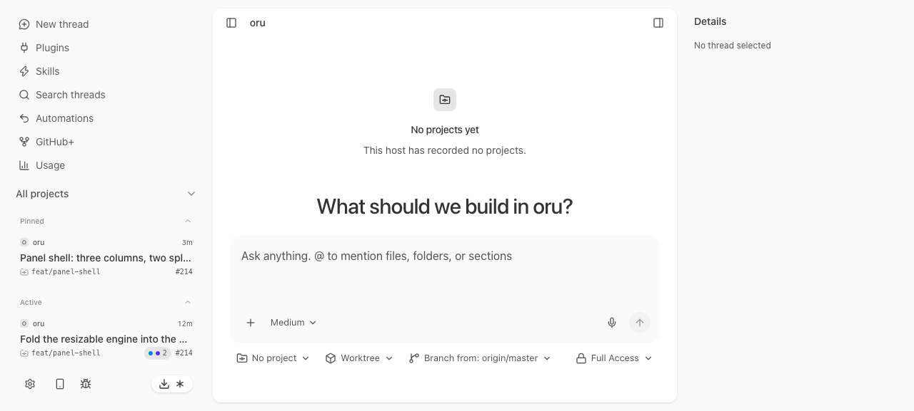
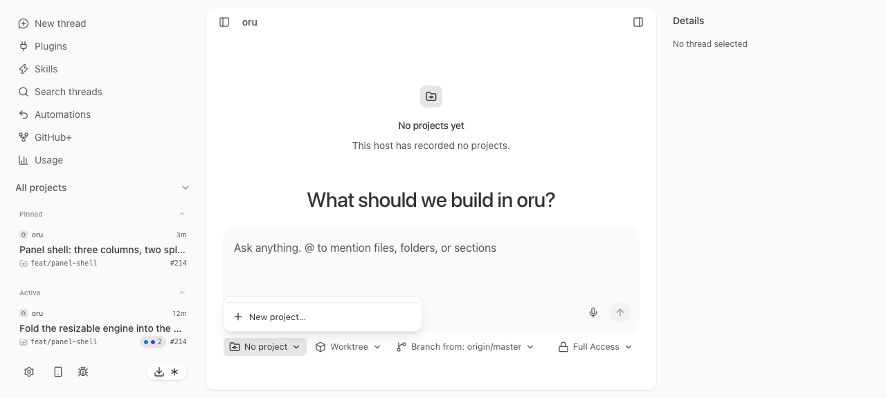
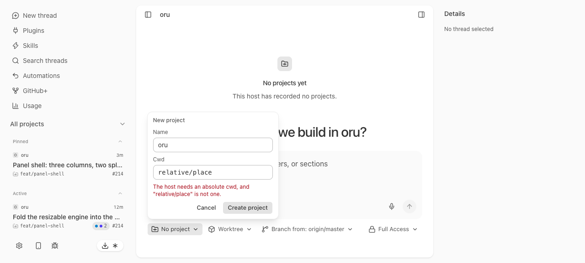
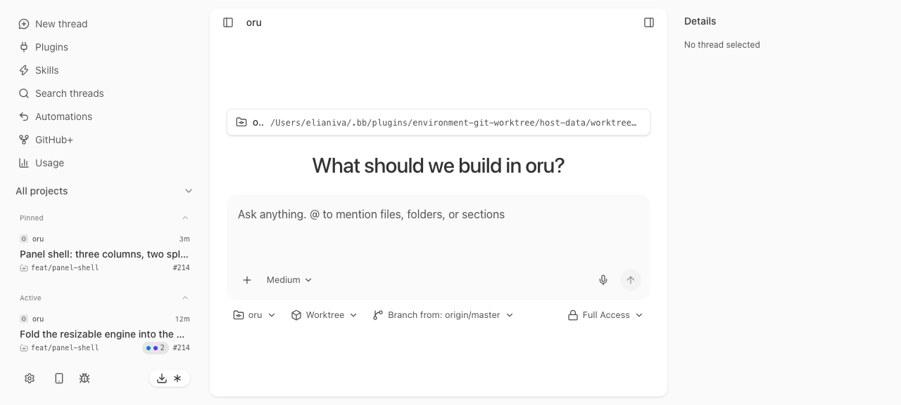
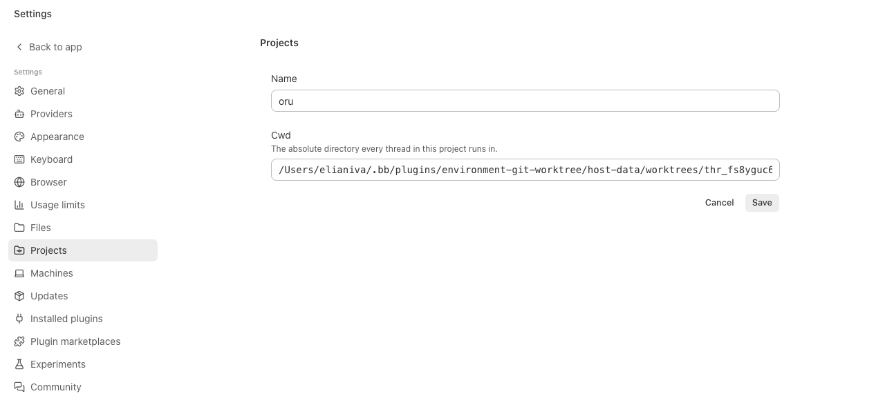
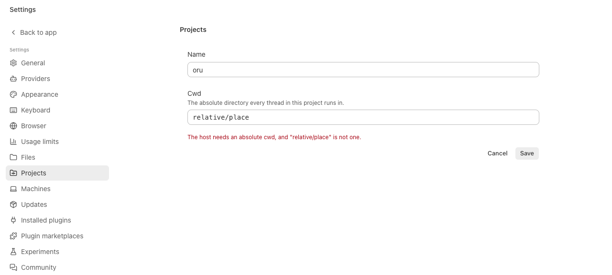
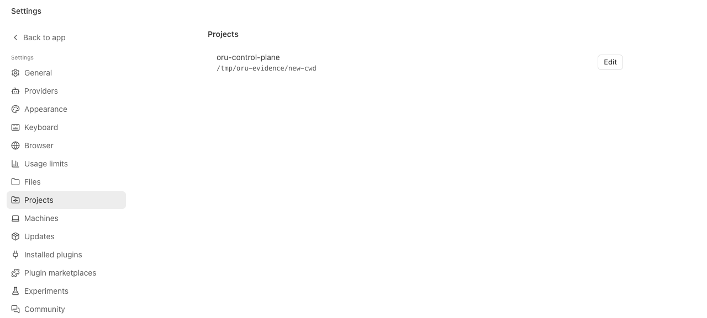
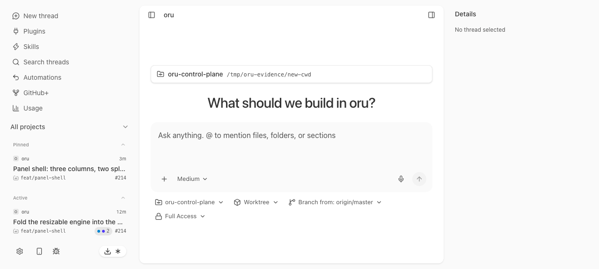
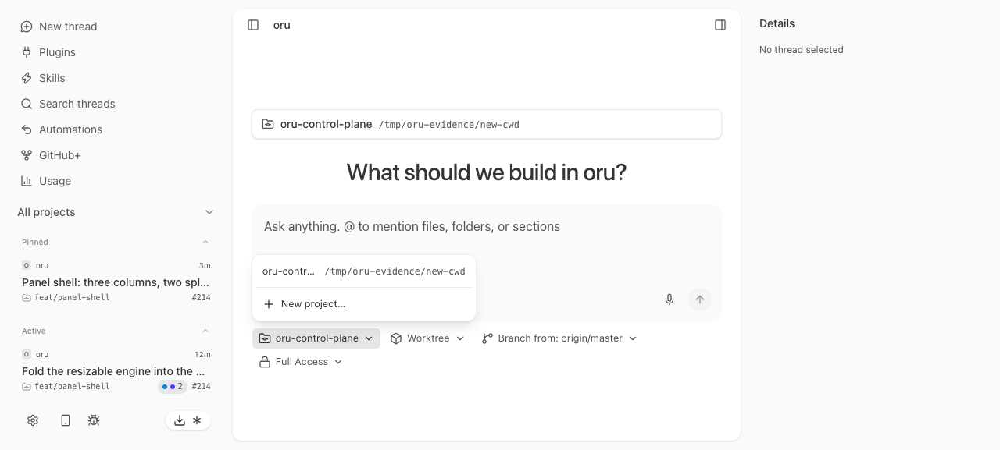

# Projects in a real browser

One agent-browser run against the worktree's own two halves, started by hand: the
host on 7497 with a fresh journal under `/tmp/oru-evidence`, Vite on 5299 with
`ORU_PROXY_TARGET=http://127.0.0.1:7497`. Every value on screen below comes from
that host's journal; the app was reloaded twice, so nothing here is a live signal.

```
$ node apps/host/src/main.ts --port 7497 --journal /tmp/oru-evidence/oru.db &
oru host listening on http://127.0.0.1:7497
$ ORU_PROXY_TARGET=http://127.0.0.1:7497 pnpm --filter ./apps/oru exec vite \
    --host 127.0.0.1 --port 5299 --strictPort &
  ➜  Local:   http://127.0.0.1:5299/

$ agent-browser open http://127.0.0.1:5299/
$ agent-browser snapshot -i -c
  ...
  - button "No project" [ref=e14]
```

A host with no projects names none: the chip is a label, not a project.



```
$ agent-browser click @e14
$ agent-browser snapshot -i -c
  - button "No project" [expanded=true, ref=e14]
  - button "New project…" [ref=e25]
```

The panel lists the host's projects — none, here — and offers the one row the app
can act on.



```
$ agent-browser click @e25
$ agent-browser fill @e27 "oru"                 # Name
$ agent-browser fill @e28 "relative/place"      # Cwd
$ agent-browser click "[data-composer-chip-submit=project]"
$ agent-browser get text "[data-composer-chip-error=project]"
The host needs an absolute cwd, and "relative/place" is not one.
$ agent-browser get count "[data-project]"
0
```

The refusal is the host's own, rendered where the write was attempted, and the
host wrote nothing.



```
$ agent-browser fill "[data-composer-chip-field=cwd]" "<the worktree>"
$ agent-browser click "[data-composer-chip-submit=project]"
$ agent-browser get text "[data-project]"
oru
/Users/elianiva/.bb/plugins/environment-git-worktree/host-data/worktrees/thr_fs8yguc6mj-1/oru

$ agent-browser screenshot 04-project-created-from-the-chip.png
$ agent-browser reload
$ agent-browser get text "[data-composer-chip=project]"
oru
$ agent-browser get text "[data-project]"
oru
/Users/elianiva/.bb/plugins/environment-git-worktree/host-data/worktrees/thr_fs8yguc6mj-1/oru
```

The chip and the row name the project the host recorded, and a reload reads the
same journal rather than anything the page kept.



```
$ agent-browser open http://127.0.0.1:5299/settings/projects
$ agent-browser click @e19                      # Edit
$ agent-browser snapshot -i -c | grep -A 5 'region "Projects"'
  - region "Projects" [ref=e3]
    - heading "Projects" [level=2, ref=e18]
    - textbox "Name" [ref=e19]: oru
    - textbox "Cwd" [ref=e20]: <the worktree>
    - button "Cancel" [ref=e21]
    - button "Save" [ref=e22]
```

The placeholder that read _"Tracked projects and their defaults will live here."_
is gone, and the editor is seeded from the host's own row.



```
$ agent-browser fill @e20 "relative/place"
$ agent-browser click @e22                      # Save
$ agent-browser get text "[data-projects-edit-error]"
The host needs an absolute cwd, and "relative/place" is not one.
```

The edit path refuses the same way the create path does, and the row is unchanged.



```
$ agent-browser fill "#settings-project-name" "oru-control-plane"
$ agent-browser fill "#settings-project-cwd" "/tmp/oru-evidence/new-cwd"
$ agent-browser click "[data-projects-save]"
$ agent-browser get text "[data-projects-row]"
oru-control-plane
/tmp/oru-evidence/new-cwd
Edit

$ agent-browser reload
$ agent-browser get text "[data-projects-row]"
oru-control-plane
/tmp/oru-evidence/new-cwd
Edit
$ agent-browser open http://127.0.0.1:5299/
$ agent-browser get text "[data-composer-chip=project]"
oru-control-plane
$ agent-browser get text "[data-project]"
oru-control-plane
/tmp/oru-evidence/new-cwd
```

Both the rename and the cwd edit are the host's answer after a reload, on both
surfaces.






Later in the same session, the chip's panel lists the project the host now holds:

```
$ agent-browser click "[data-composer-chip=project]"
$ agent-browser get text "[data-composer-chip-option]"
oru-control-plane
/tmp/oru-evidence/new-cwd
```

Each row is the host's own name and cwd, and `New project…` follows them.



```
$ agent-browser errors
                                  # no page errors at all

$ agent-browser console
[debug] [vite] connecting...
[debug] [vite] connected.
                                  # nothing from the app
```

## What this run does not cover

The composer's send path is #51, so no turn can be started from the UI yet. The
claim that a thread runs its next turn in the project's edited cwd is proved where
the loop is: `plugins/inference/test/runtime.test.ts` runs two real turns against a
harness that records `HarnessTurnRequest.cwd` and writes `project/updated` between
them, and `apps/host/test/project.test.ts` proves `UpdateProject` records the fact
and that `foldThreadCwd` follows it.

The left column's project names and the `Worktree`, `Branch from`, `Full Access`,
and `Medium` chips are the pre-existing fixtures #50, #51, and #52 replace. The one
composer chip this run covers is the project chip; the fabricated `repo` chip it
replaced is gone.
